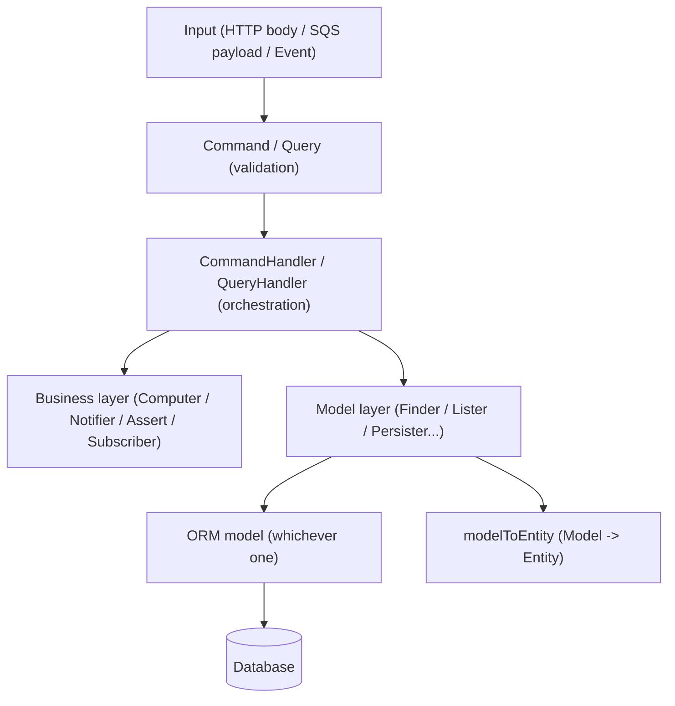

# CQRS-friendly architecture

Strict layered separation using generic contracts (interfaces) reused throughout the code,
which makes each layer independently testable/mockable.

The running example below is a classic `User` CRUD, fully backed by a database.

## Why "not pure CQRS"

What's really at play is a combination of several patterns:

| Pattern                                            | Where it applies                                                                                                                       |
| -------------------------------------------------- | -------------------------------------------------------------------------------------------------------------------------------------- |
| **CQS** (Command-Query Separation, Bertrand Meyer) | Each `Command`/`Query` makes explicit whether the operation reads or writes                                                            |
| **Command pattern (GoF)**                          | `Command` encapsulates a request as an object passed to a handler                                                                      |
| **Repository pattern**                             | `Finder`/`TryFinder`/`Lister`/`Persister`/`Remover`                                                                                    |
| **Ports & Adapters / hexagonal architecture**      | The generic interfaces (`Finder<Entity>`...) are the _ports_; their concrete implementations are the _adapters_ that plug into the ORM |
| **Layered / Service Layer**                        | Handler → CommandHandler → business layer → Repository, in strictly descending layers                                                  |



Only the model layer (sections 4-5) knows about the ORM. Everything else (Command, CommandHandler,
business layer) only handles `Entity` objects and an opaque `Transaction` type — the ORM is
therefore interchangeable without touching the rest of the code.

## 1. Command / Query — input validation

A `Command` (write) or a `Query` (read) is a class that validates and carries data, without any
business logic.

```typescript
type CreateUserPayload = {
  email: string;
  firstName: string;
  lastName: string;
  organisationId: string;
};

const schema: JSONSchemaType<CreateUserPayload> = {
  type: 'object',
  properties: {
    email: { type: 'string', format: 'email', nullable: false },
    firstName: { type: 'string', nullable: false },
    lastName: { type: 'string', nullable: false },
    organisationId: { type: 'string', nullable: false },
  },
  required: ['email', 'firstName', 'lastName', 'organisationId'],
};

class CreateUserCommand {
  email: string;
  firstName: string;
  lastName: string;
  organisationId: string;

  constructor(
    payload: Record<string, unknown>,
    private callerId: string,
  ) {
    validatePayload(payload, schema, false); // fails fast if the payload is invalid
    this.email = payload.email;
    this.firstName = payload.firstName;
    this.lastName = payload.lastName;
    this.organisationId = payload.organisationId;
  }
}
```

- AJV or Zod validation (`validatePayload`) directly in the constructor → impossible to get an
  invalid instance.
- Can also carry the call context (`callerId`, `roles`) for authorization.
- `Query` follows the same principle but for read parameters (usually no strict validation,
  just a typed container) — e.g. `GetUserQuery { id: string }` or
  `ListUsersQuery { organisationId: string; offset?: number; limit?: number }`.

## 2. CommandHandler / QueryHandler — orchestration

The handler never contains business rules or SQL. It receives its dependencies via constructor
injection (no DI container) and orchestrates: read → business computation → transactional write.

```typescript
class CreateUserCommandHandler {
  constructor(
    private userRepository: Persister<User>,
    private organisationRepository: Finder<Organisation>,
    private userComputer: Computer<User, Organisation>,
    private userNotifier: Notifier<User>,
  ) {}

  async handle(command: CreateUserCommand): Promise<User> {
    const organisation = await this.organisationRepository.findOrFail({
      id: command.organisationId,
    });

    const user = this.buildUser(command);
    const computedUser = await this.userComputer.compute(user, organisation);

    await this.userRepository.persist(computedUser);

    await this.userNotifier.notify(computedUser);

    return computedUser;
  }

  private buildUser(command: CreateUserCommand): User {
    return {
      id: uuid(),
      email: command.email,
      firstName: command.firstName,
      lastName: command.lastName,
      organisationId: command.organisationId,
      status: UserStatus.PENDING,
      createdDate: new Date(),
      updatedDate: new Date(),
    };
  }
}
```

The read counterpart follows the exact same principle, but without a write or transaction:

```typescript
class GetUserQueryHandler {
  constructor(private userRepository: Finder<User>) {}

  async handle(query: GetUserQuery): Promise<User> {
    return this.userRepository.findOrFail({ id: query.id });
  }
}
```

Key points:

- Dependencies are typed by generic interface, never by concrete implementation → easy to stub in unit tests.
- A single dependency can compose multiple contracts: `Finder<User> & Persister<User>`.
- Multiple writes share a single transaction (`Transaction` is an opaque type, independent of the underlying ORM) passed as a parameter to every `persist`/`bulkPersist` call.
- `withTransaction` is a function provided by the model layer that opens/commits/rolls back the transaction, regardless of which ORM is used underneath.
- "Manual" instantiation in the HTTP handler or the SQS processor (no IoC container):

```typescript
// src/handlers/users/createUserHandler.ts
const createUserHandler: HandlerFunction = async (req, res) => {
  await assertRequestHasOneOfRole(req, Role.ROLE_ADMIN);

  const command = new CreateUserCommand(req.body, req.callerId);
  const handler = new CreateUserCommandHandler(
    UserPersister,
    OrganisationFinder,
    new UserComputer(),
    userNotifierService,
  );

  const result = await handler.handle(command);
  res.status(201).send(result);
};
```

## 3. Business layer — pure logic, no SQL

Always injected into the `CommandHandler`, never hardcoded inside it. Only handles `Entity`
objects (pure TS types in `src/entities/`), never a `Model`/record specific to the ORM.

| Contract                    | Role                                              | Abstract shape                                                                                        |
| --------------------------- | ------------------------------------------------- | ----------------------------------------------------------------------------------------------------- |
| `Computer<Entity, Context>` | Deterministic computation of a state              | `compute(entity: Entity, context: Context): Promise<Entity>`                                          |
| `Notifier<Entity>`          | Side effect (email, notification) after an action | `notify(entity: Entity): Promise<void>`                                                               |
| `Assert`                    | Authorization/validation guard                    | functions called before/within the HTTP handler, throw an error (`ForbiddenError`, `BadRequestError`) |
| `Subscriber<Entity>`        | Reacts to an event within the same transaction    | `subscribe(entity: Entity, transaction?: Transaction): Promise<void>`                                 |

```typescript
class UserComputer implements Computer<User, Organisation> {
  public async compute(user: User, organisation: Organisation): Promise<User> {
    if (organisation.isSuspended) {
      return { ...user, status: UserStatus.SUSPENDED };
    }
    return { ...user, status: UserStatus.ACTIVE };
  }
}

class NotifyManagersOnUserCreationSubscriber implements Subscriber<User> {
  constructor(private notificationPersister: Persister<Notification>) {}

  public async subscribe(user: User, transaction?: Transaction) {
    await this.notificationPersister.persist(
      this.buildNotification(user),
      transaction,
    );
  }
}
```

`Subscriber` is the mechanism used to chain side effects after a standard HTTP action, without
having to write a full `CommandHandler` — it's the bridge between the simple CRUD pattern and
full CQRS. For example, a `DELETE /users/:id` endpoint based on `removeHandler` can trigger a
`Subscriber<User>` that purges associated data (sessions, pending invitations...) within the same
transaction as the deletion.

## 4. Model layer — data access

Generic interfaces, independent of any ORM on the caller side: the rest of the application only
knows these contracts and `Entity` objects (never a `Model` nor an ORM-specific type).

**Read:**

| Interface                           | Abstract signature                                                   |
| ----------------------------------- | -------------------------------------------------------------------- |
| `Finder<Entity, Criteria>`          | `findOrFail(criteria): Promise<Entity>` — throws `NotFoundError`     |
| `TryFinder<Entity, Criteria>`       | `find(criteria): Promise<Entity \| null>`                            |
| `Lister<Criteria, Entity>`          | `list(criteria, options?: ListOptions): Promise<ListResult<Entity>>` |
| `PaginatedLister<Criteria, Entity>` | same as `Lister` but `options` is mandatory                          |
| `Counter<Criteria>`                 | `count(criteria): Promise<number>`                                   |

**Write:**

| Interface               | Abstract signature                                      |
| ----------------------- | ------------------------------------------------------- |
| `Persister<Entity>`     | `persist(entity, transaction?): Promise<void>` — upsert |
| `BulkPersister<Entity>` | `bulkPersist(entities[], transaction?): Promise<void>`  |
| `Remover<Entity>`       | `remove(entity, transaction?): Promise<void>`           |

Typical implementation (a literal object, the most common case). Only this file knows about the
ORM — its concrete shape (query builder, filter syntax...) varies depending on the chosen ORM,
but the contract exposed to the rest of the application never changes:

```typescript
export type UserFinderCriteria = {
  id?: string;
  email?: string;
  organisationId?: string;
};

// TryFinder — translating criteria -> query is an ORM-specific implementation detail
const UserTryFinder: TryFinder<User, UserFinderCriteria> = {
  async find(criteria): Promise<User | null> {
    const record = await orm.findOne(UserTable, matching(criteria));
    return record ? userRecordToEntity(record) : null;
  },
};

// Finder that delegates to the TryFinder
const UserFinder: Finder<User, UserFinderCriteria> = {
  async findOrFail(criteria): Promise<User> {
    const user = await UserTryFinder.find(criteria);
    if (!user) throw new NotFoundError('User does not exist', criteria);
    return user;
  },
};

// Lister
const UserLister: Lister<UserFinderCriteria, User> = {
  async list(criteria, options): Promise<ListResult<User>> {
    const { records, totalCount } = await orm.findAndCount(
      UserTable,
      matching(criteria),
      options,
    );
    return { list: records.map(userRecordToEntity), totalCount };
  },
};

// Persister
const UserPersister: Persister<User> = {
  persist: (user, transaction) => orm.upsert(UserTable, user, transaction),
};

// Remover
const UserRemover: Remover<User> = {
  remove: (user, transaction) =>
    orm.destroy(UserTable, { id: user.id }, transaction),
};
```

Composition inside a `CommandHandler`: via type intersection or spreading literal objects:

```typescript
new SomeCommandHandler(
    { ...UserPersister, ...UserTryFinder }, // satisfies Persister<User> & TryFinder<User, ...>
    ...
);
```

## 5. ORM model + mapping

At the bottom of the stack, the model definition (decorated class, declarative schema, or any
other mechanism specific to the chosen ORM) contains no logic, just the table ↔ column mapping.
Abstract shape, independent of the ORM:

```typescript
// Table <-> field mapping definition, in whatever form the ORM requires
const UserTable = defineTable('users', {
  id: { type: 'uuid', primaryKey: true },
  email: { type: 'string' },
  firstName: { type: 'string' },
  lastName: { type: 'string' },
  organisationId: { type: 'uuid' },
  status: { type: 'string' },
  createdDate: { type: 'date' },
  updatedDate: { type: 'date' },
});
```

A dedicated mapper converts the raw record returned by the ORM → `Entity` (never the other way
around outside of the repository). It's the only function that needs to know the exact shape of
the records returned by the ORM:

```typescript
const userRecordToEntity = (record: UserRecord): User => ({
  id: record.id,
  email: record.email,
  firstName: record.firstName,
  lastName: record.lastName,
  organisationId: record.organisationId,
  status: record.status,
  createdDate: record.createdDate,
  updatedDate: record.updatedDate,
});
```

Replacing the ORM therefore only requires rewriting: the table definition, the mapper, and the
body of the `Finder`/`Lister`/`Persister`/... functions — without touching the `Command`,
`CommandHandler`, the business layer, or the HTTP handlers/consumers.

## Why this split

- **Testability**: each `CommandHandler` dependency is a 1-2 method interface → easy to stub in unit tests.
- **ORM framework isolation**: the business layer and HTTP handlers never know which ORM is used, only pure TS `Entity` objects — the ORM is an implementation detail confined to the model layer.
- **Composability**: the same contracts (`Finder`, `Persister`, etc.) are reused identically across all domains (users, organisations, projects...), so the pattern generalizes without reinventing an abstraction per domain.
- **Explicit transactionality**: the optional `transaction?: Transaction` on every write method lets the `CommandHandler` guarantee multi-repository atomicity without the model layer needing to know about it upfront.
