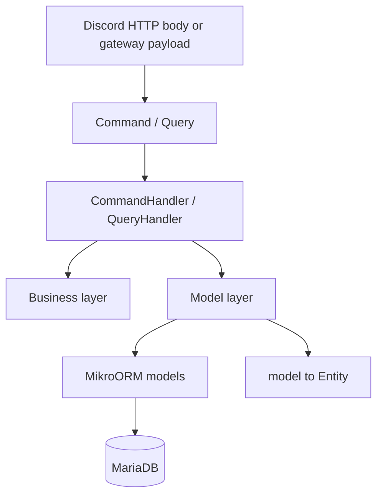

# CQRS-friendly application layers

P'tit Pote is not pure CQRS. There is no event store and no message bus. Write
and read use cases are still split into commands and queries so each layer can
be tested or replaced on its own.



Only `src/db/model/` and the MikroORM classes in `src/db/entities/` know the ORM.
Commands, handlers, and business code use plain `Entity` types from
`src/entities/` plus an opaque `Transaction`.

## 1. Command / Query

A command or query validates and carries input. It does not decide permissions
beyond the caller context it was given, and it does not touch the database.

`validatePayload` in `src/cqrs/validatePayload.ts` runs Zod inside the
constructor. A failed parse throws `BadRequestError`, so callers cannot hold an
invalid instance. `SetAliasCommand` and `CreatePollCommand` follow that shape.
Queries such as `ListAliasesQuery` are typed containers when the input is
already a single id.

Discord moderator checks stay in the HTTP adapter via
`assertInteractionUserIsModerator`, which throws `ForbiddenError`.

## 2. CommandHandler / QueryHandler

Handlers live under `src/domain/`. They receive dependencies through the
constructor (interfaces, not concrete classes) and are built by hand in the
Discord adapter. There is no IoC container.

A handler may read, run a computer or assert, then write. Multiple writes share
one `withTransaction` callback from `src/db/model/session.ts`. `Transaction` is
an empty branded object; repositories unwrap it back to the MikroORM session.

Example wiring in a CTA adapter:

```ts
const handler = new SetAliasCommandHandler(
  { ...DiscordGuildTryFinder, ...DiscordGuildPersister },
  { ...MessageAliasedLister, ...MessageAliasedPersister },
);
await handler.handle(command);
```

The same object can satisfy `Persister<T> & TryFinder<T, Criteria>` by spread.

## 3. Business layer

| Contract                    | Role                                | Where it is used                                  |
| --------------------------- | ----------------------------------- | ------------------------------------------------- |
| `Computer<Entity, Context>` | Deterministic state change          | alias quota, poll publish, poll vote, poll report |
| `Notifier<Entity>`          | Side effect after the decision      | Discord report messages                           |
| `Assert`                    | Guard that throws                   | moderator check, draft poll, vote still open      |
| `Subscriber<Entity>`        | Extra write in the same transaction | interface only; no current use case needs one     |

Business modules under `src/domain/` must not import MikroORM. They throw
`NotFoundError`, `ForbiddenError`, `BadRequestError`, `TooManyError`,
`PollAlreadyPublishedError`, or `VoteClosedError` from `src/cqrs/errors.ts`.
The Discord adapter turns those into the existing ephemeral responses.

## 4. Model layer

Generic contracts are declared in `src/cqrs/contracts.ts`.

| Interface                    | Behavior                                                         |
| ---------------------------- | ---------------------------------------------------------------- |
| `TryFinder`                  | `find` returns `Entity` or `null`                                |
| `Finder`                     | `findOrFail` throws `NotFoundError`                              |
| `Lister` / `PaginatedLister` | `list` returns `{ items }`                                       |
| `Counter`                    | `count`                                                          |
| `Persister`                  | `persist` upserts one entity                                     |
| `BulkPersister`              | `bulkPersist`                                                    |
| `Remover`                    | `remove` (alias removal is a soft delete)                        |
| `LockingFinder`              | `findOrFailForUpdate` locks the row for the caller's transaction |

Read and write methods take an optional `transaction` so a handler can keep a
lock and the following reads on the same session. `LockingFinder` exists
because poll votes and reports need a pessimistic write lock; the handler still
does not mention MikroORM's `LockMode`.

Implementations are object literals in `src/db/model/`. `MessageAliasedCounter`
is the `Counter` implementation. A class is appropriate only when a repository
needs constructor dependencies.

`withTransaction` forks an entity manager, opens `transactional`, and binds that
session to the opaque `Transaction` for the callback. Commit and rollback stay
inside the model layer.

## 5. ORM models and mapping

`src/db/entities/*.entity.ts` stay the MikroORM classes: table mapping only.
`src/db/model/mapToEntity.ts` is the only place that copies a managed record
into an `Entity`. Replacing MikroORM means rewriting table classes, that
mapper, and the bodies of the finders and persisters.

Plain entities use ids (`guildId`, `pollId`, `pollStepId`) instead of ORM
collections.

## What still talks to MikroORM

- `src/db/model/**`
- `src/db/entities/**`, `src/db/EntityBase.ts`, migrations, and `mikro-orm.config.ts`
- `src/db/services/discordGuild.service.ts`, kept for the existing service test
- Test fixtures that seed rows directly

Discord handlers, the gateway `GuildCreate` path, and `src/domain/**` do not
import entity classes.

## Tests

Unit tests in `tests/src/cqrs/` and `tests/src/domain/` stub the repository
interfaces and the transaction runner. Integration tests still seed MikroORM
models and call the Discord handlers, which now delegate to command handlers.
