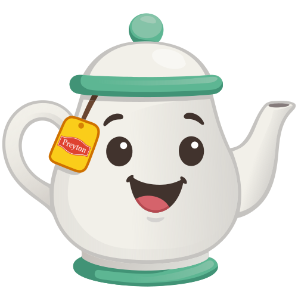

  

# P'tit Pote

**P'tit Pote** is a Discord bot for polls, reusable message aliases, thread
reminders, and a few utility commands.

These guides are for server members and moderators. They describe command
workflows, permissions, and expected bot behavior — not the codebase.

## Commands

- [`/poll`](./poll/poll.md) — create polls, vote, and view reports
- [`/alias`](./alias/alias.md) — store, post, and remove reusable message aliases
- [`/remind`](./remind/remind.md) — bump forgotten threads after idle days
- [`/gimme`](./gimme/gimme.md) — otter image, emoji gallery, and version
