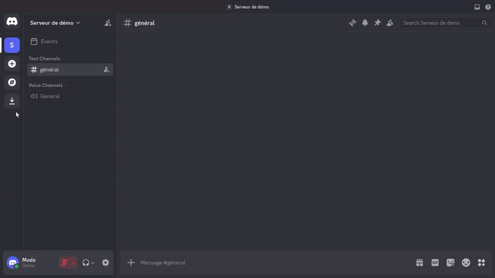

## 📝 Alias Workflow

The `/alias` command lets moderators store reusable message templates per
server and post them on demand.

### Intent

Aliases avoid retyping recurring announcements, welcome messages, or FAQ
replies. Each alias maps a short lowercase identifier to a stored message body
scoped to one Discord guild.

### Moderator flow

All `/alias` subcommands require guild scope and moderator permissions. The
moderator check accepts members with at least one of these Discord permissions:
Administrator, Manage Server, Manage Channels, Manage Messages, Kick Members,
or Ban Members.

1. **Define or update an alias** with `/alias set`:
   - `alias`: lowercase letters and digits only (`/^[a-z0-9]+$/`), 1–50
     characters;
   - `message`: stored content, 1–500 characters.
   - Creating a new alias persists the guild and alias in MariaDB. Reusing an
     existing alias name updates its message in place.
   - Success replies publicly with **Ok! C'est noté ;)**.


2. **Post a stored message** with `/alias say alias:<name>`:
   - Looks up the alias for the current guild.
   - Posts the stored message publicly in the channel where the command runs.
   - Unknown aliases reply ephemerally with an error message.



3. **List configured aliases** with `/alias ls`:
   - Returns alias names sorted alphabetically for the current guild.
   - Only names are shown, not message contents.
   - An empty list replies ephemerally with **Ahem... j'ai rien trouvé... 🤷**.


### Constraints

- Guild-only: DMs and interactions without `guild_id` fail the moderator check
  or cannot reach the database layer.
- Aliases are unique per guild (`server` + `alias`).
- Invalid alias or message payloads return HTTP 400 with validation details.
- Non-moderators receive an ephemeral **Ahem... je ne suis pas habilité à le
  faire 🤷** response before any subcommand runs.

### Examples

```text
/alias set alias:welcome message:Bienvenue sur le serveur !
/alias say alias:welcome
/alias ls
```

Updating an existing alias:

```text
/alias set alias:welcome message:Nouveau message de bienvenue.
```

### Implementation map

- Slash command declaration, moderator gate, and subcommand dispatch:
  `src/commands/slash/alias/index.ts`.
- Subcommand handlers: `src/commands/slash/alias/set.ts`, `say.ts`, `ls.ts`.
- Moderator permission check: `src/commands/assert/assertInteractionUserIsModerator.ts`.
- Persistence model: `MessageAliased` linked to `DiscordGuild` in
  `src/db/entities/`.
- Shared response helpers: `src/commands/commonMessages.ts`.
