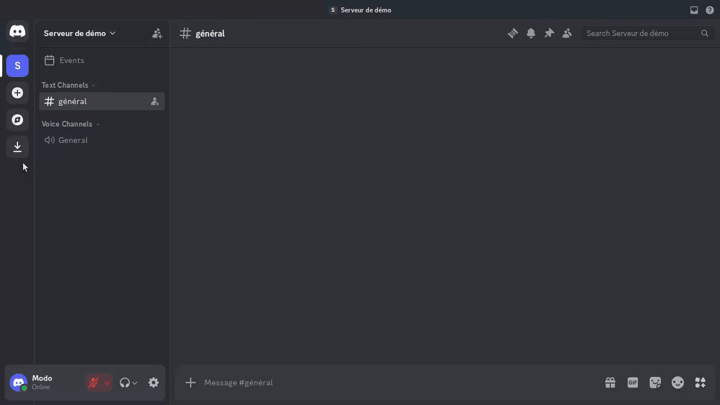

## 📝 Alias Workflow

The `/alias` command lets moderators store reusable message templates per
server and post them on demand.

### Intent

Aliases avoid retyping recurring announcements, welcome messages, or FAQ
replies. Each alias maps a short lowercase identifier to a stored message body
on your server.

### Moderator flow

All `/alias` subcommands require guild scope and moderator permissions. The
moderator check accepts members with at least one of these Discord permissions:
Administrator, Manage Server, Manage Channels, Manage Messages, Kick Members,
or Ban Members.

1. **Define or update an alias** with `/alias set`:
   - Opens a modal with:
     - `alias`: lowercase letters and digits only (`/^[a-z0-9]+$/`), 1–50
       characters;
     - `message`: stored content, 1–500 characters.
   - Fill the fields and submit the modal.
   - Reusing an existing alias name updates its message.
   - Success replies publicly with **Ok! C'est noté ;)**.


2. **Post a stored message** with `/alias say`:
   - Opens a modal with a select listing the current guild aliases.
   - Choose an alias and submit.
   - Posts the stored message publicly in the channel where the command runs.
   - If no aliases exist, replies ephemerally with **Ahem... j'ai rien
     trouvé... 🤷**.


3. **Remove an alias** with `/alias rm`:
   - Opens a modal with a select listing the current guild aliases.
   - Choose an alias and submit to soft-delete it (it disappears from
     `/alias ls` and `/alias say`).
   - The same alias name can be created again later with `/alias set`.
   - If no aliases exist, replies ephemerally with **Ahem... j'ai rien
     trouvé... 🤷**.
   - Success replies publicly with **Ok! C'est noté ;)**.



4. **List configured aliases** with `/alias ls`:
   - Returns alias names sorted alphabetically for the current guild.
   - Only names are shown, not message contents.
   - An empty list replies ephemerally with **Ahem... j'ai rien trouvé... 🤷**.


### Constraints

- Guild-only: aliases are managed per Discord server.
- Alias names are unique per server among active aliases.
- Alias names must use lowercase letters and digits only.
- Alias messages can contain up to 500 characters.
- A server can store at most 20 active aliases. Creating another one replies
  ephemerally with **Ahem... ca fait beaucoup là. Non?**; updating an existing
  alias still works.
- Non-moderators receive an ephemeral **Ahem... je ne suis pas habilité à le
  faire 🤷** response before any subcommand runs.

### Examples

```text
/alias set  → modal: alias=welcome, message=Bienvenue sur le serveur !
/alias say  → modal: choose welcome from the select
/alias rm   → modal: choose welcome from the select
/alias ls
```

Updating an existing alias:

```text
/alias set  → modal: alias=welcome, message=Nouveau message de bienvenue.
```
