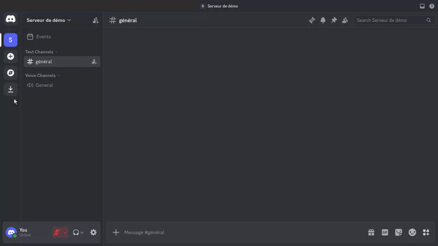
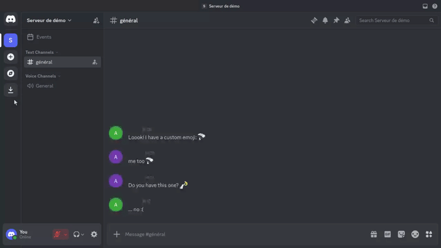
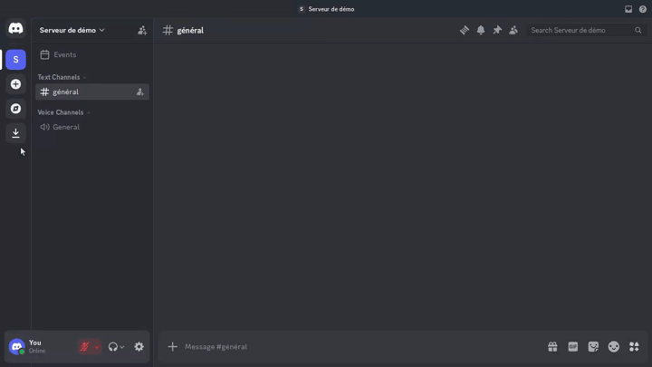

## 🖼 Gimme Workflow

The `/gimme` command returns images or bot metadata. Unlike `/alias` and
`/poll`, it has no moderator gate and is available to any member who can use
slash commands.

### Intent

`/gimme` provides lightweight utility responses: a fixed otter image, custom
emoji previews scraped from recent channel messages, and the running bot
version.

### Usage

#### `/gimme otter`

Posts a public media gallery with the repository otter image:

`https://github.com/GTSpray/P-titPote/raw/main/assets/otter.png`



#### `/gimme emoji`

Scans the current channel for custom Discord emojis and returns up to three of
them as a public media gallery.



The bot looks at recent channel messages, ignores very long messages, and keeps
custom Discord emojis such as `<:name:id>` or `<a:name:id>`. Unicode emojis are
not collected. When no qualifying emoji are found, the bot replies ephemerally
with **Ahem... j'ai rien trouvé... 🤷**. When emoji are found, the response
includes **Voilà.. ce que j'ai trouvé** followed by the gallery.

#### `/gimme version`

Posts a public text message with a random emoji and the running bot version.



### Constraints

- `/gimme emoji` needs bot access to read channel message history.
- Default member permission is **Send Messages**. The command supports guild
  install, user install, guild channels, private channels, and bot DMs.
- `/gimme emoji` returns up to three custom emojis.

### Examples

```text
/gimme otter
/gimme emoji
/gimme version
```

Typical `/gimme emoji` behavior in a channel where users recently posted custom
emotes:

```text
User A: gg <a:party:123456789012345678>
User B: +1 <a:party:123456789012345678> <a:fire:987654321098765432>
/gimme emoji
→ gallery with party and fire (duplicate party ID counted once)
```
