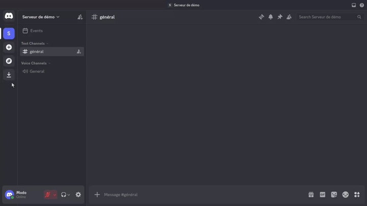
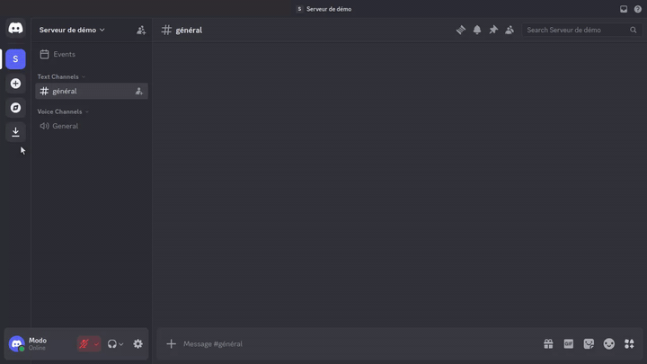

## 🗳 Poll Workflow

The `/poll create` command drives the poll lifecycle through Discord modals and
buttons.

### Moderator flow

All `/poll` draft and publication actions are moderator-only. The moderator
check accepts members with at least one of these Discord permissions:
Administrator, Manage Server, Manage Channels, Manage Messages, Kick Members,
or Ban Members.

1. Run `/poll create` in a server channel. The command opens a modal for:
   - poll title, 1-45 characters;
   - optional voter role (`Role des sondés`);
   - first question, 1-45 characters;
   - optional question description, up to 100 characters.
2. Use the ephemeral draft summary buttons to finish the poll:
   - **Ajouter des choix** adds choices to the latest question. The modal shows
     up to 4 inputs at a time, requires the first two choices, and each question
     can have at most 10 choices.
   - **Nouvelle question** adds another question. Draft polls can contain up to
     4 questions.
   - **Publier le sondage** posts the public voting message in the current
     channel and records the publication date.
3. After publication, the draft is immutable: adding questions, adding choices,
   or publishing again returns an ephemeral error.



### Voter flow

- Published polls show **Je vote!** and **Compte rendu** buttons.
- If the poll has a voter role, the published message pings that role and only
  members with the role can open or submit the vote modal.
- Questions with choices render as single-select fields. Questions without
  choices render as free-text answers, up to 400 characters.
- Existing answers are pre-filled, so submitting the vote modal again updates
  the member's previous answers for that poll.
- Voting is closed when `Poll.endDate` is set to a past or current time.


### Reports and closing

The **Compte rendu** button is moderator-only. When clicked, it:

- closes the poll immediately if it was still open by setting `Poll.endDate` to
  now;
- posts one or more public summary messages in the current channel;
- reports unique participant count, per-choice vote counts and rounded
  percentages, and chronological free-text answers;
- disables mentions in report messages and escapes `@` in free-text answers;
- splits reports over multiple Discord messages when the content exceeds the
  2,000 character message limit.



### Examples

```text
/poll create
→ title + first question
→ Ajouter des choix (mercredi, jeudi, vendredi)
→ Nouvelle question (avez vous des alergenes)
→ Publier le sondage
→ Je vote!
→ Compte rendu
```

### Constraints

- Guild-only: DMs and interactions without `guild_id` are not supported for the
  poll workflow.
- Non-moderators receive an ephemeral **Ahem... je ne suis pas habilité à le
  faire 🤷** response for create, draft updates, publish, and reports.
