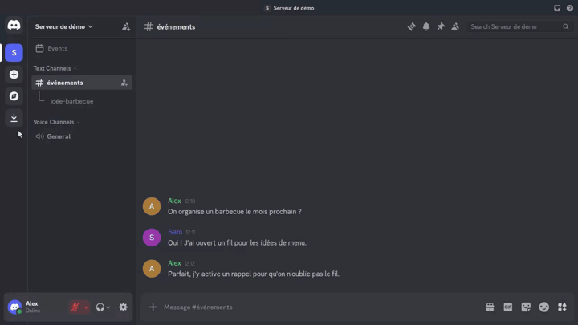
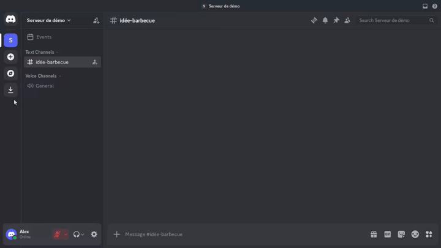
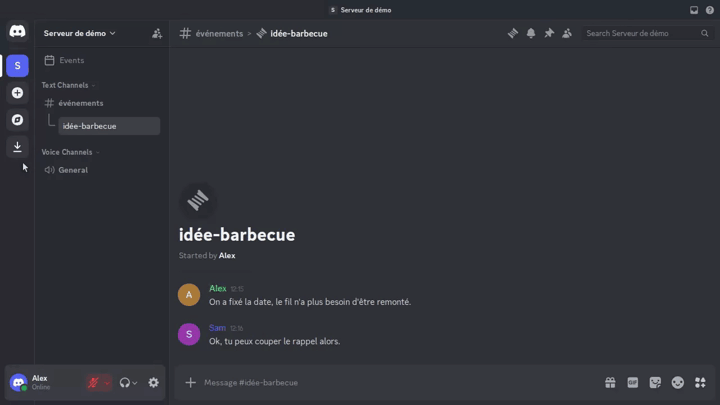

## Remind Workflow

The `/remind` command keeps forgotten Discord **threads** visible by posting a
short bump message when a thread stays quiet for too long.

### Intent

One automatic reminder per thread (shared by everyone on the server). The bot
checks about once an hour and only bumps a thread if its last message is older
than the configured idle period. The bump itself counts as activity, so the
thread will not be bumped again until it goes quiet for another full period.

### Thread only

All `/remind` subcommands must be run **inside a thread**. In a normal text
channel the bot replies ephemerally with **Ahem... cette commande ne marche que
dans un fil 🤷**.

### Activate

Anyone who can send messages can run `/remind on` with:

- `days`: integer from **1** to **30** — days of inactivity before a bump.

Success replies ephemerally with **Ok! Je remonterai ce fil s'il reste
silencieux {days} jour(s) ;)**.

If a reminder is already active on that thread, the bot replies **Ahem... il y a
déjà un rappel sur ce fil 🤷**. Turn it off first if you need a different
`days` value.

### Status

Anyone can run `/remind status` in the thread:

- inactive → **Ahem... pas de rappel sur ce fil 🤷**
- active → shows the idle threshold and who enabled it

### Deactivate

`/remind off` soft-stops the reminder. Only:

- the member who enabled it, or
- a moderator (Administrator, Manage Server, Manage Channels, Manage Messages,
  Kick Members, or Ban Members)

Success replies **Ok! Plus de rappel sur ce fil ;)**. Without a reminder, the
bot replies **Ahem... j'ai rien trouvé... 🤷**. Non-owners without moderator
rights get **Ahem... je ne suis pas habilité à le faire 🤷**.

### Automatic bump

When the idle threshold is reached, the bot posts **⬆️** in the thread (and
unarchives the thread first if needed). If a previous bump message from the bot
is still there, it is removed before the new one is posted. If someone writes in
the thread before the next bump is due, the bot removes the last **⬆️** (if still
present) and waits again from that activity. No scenario video covers the hourly
check — only the slash commands above.
