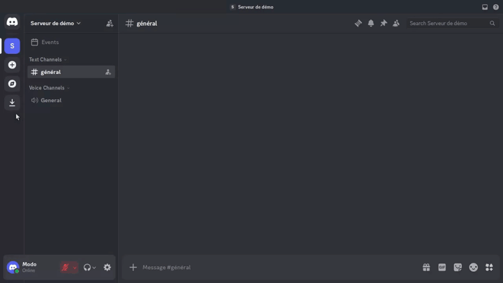
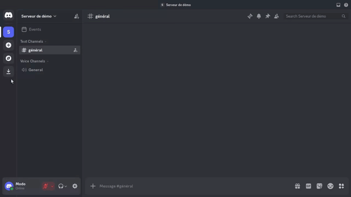

## Trigger Workflow

The `/trigger` command lets moderators configure automations that run when a
member joins the server: a welcome message in a channel, and/or an automatic
role.

### Intent

Triggers avoid manual onboarding steps. Each automation has a short name, a
type, and type-specific settings. Disabled triggers stay configured but do not
run until you activate them again.

### Moderator flow

`/trigger` requires guild scope and moderator permissions. The moderator check
accepts members with at least one of these Discord permissions: Administrator,
Manage Server, Manage Channels, Manage Messages, Kick Members, or Ban Members.

The command replies ephemerally with a select to choose an action:

1. **Créer** — create a new automation:
   - Pick the type (**Message de bienvenue** or **Rôle de bienvenue**).
   - A modal asks for:
     - `name`: lowercase letters, digits, spaces, `_`, `-`, `.` — 1–50
       characters;
     - welcome message: target channel + message text (1–2000 characters);
     - welcome role: role to assign.
   - If the name already exists, the bot replies ephemerally that it is already
     taken (no overwrite).



2. **Modifier** — change settings of an existing automation (name and enabled
   state stay the same).

3. **Activer** / **Désactiver** / **Supprimer** — pick an automation, then the
   action applies immediately.
   - **Activer** turns a disabled automation back on.
   - **Désactiver** keeps the automation but stops it from running on join.
   - **Supprimer** removes it; the same name can be created again later.
   - If none exist, replies ephemerally with **Ahem... j'ai rien trouvé... 🤷**.



### Welcome message placeholders

In the welcome message text you can use:

- `{user}` — mention of the new member
- `{username}` — display username
- `{server}` — server name

### Constraints

- Guild-only: triggers are managed per Discord server.
- Names are unique per server among non-deleted triggers.
- Names may use lowercase letters, digits, spaces, `_`, `-`, and `.`.
- A server can store at most **10** non-deleted triggers (disabled ones count).
  Creating another one replies ephemerally with **Ahem... ca fait beaucoup là.
  Non?**
- Non-moderators receive an ephemeral **Ahem... je ne suis pas habilité à le
  faire 🤷** response before the menu runs.
- The bot needs the privileged **Server Members Intent** enabled in the Discord
  Developer Portal for join events to fire.
- Welcome roles need **Manage Roles**, and the bot’s role must sit **above** the
  role it assigns (Server Settings → Roles). Otherwise Discord returns Missing
  Access and the join role is skipped.

### Examples

```text
/trigger → Créer → Message de bienvenue
         → modal: name=welcome, channel=#général, message=Bienvenue {user} !
/trigger → Créer → Rôle de bienvenue
         → modal: name=member, role=@Membre
/trigger → Modifier → welcome → modal: new channel / message
/trigger → Désactiver → welcome
/trigger → Activer → welcome
/trigger → Supprimer → member
```
